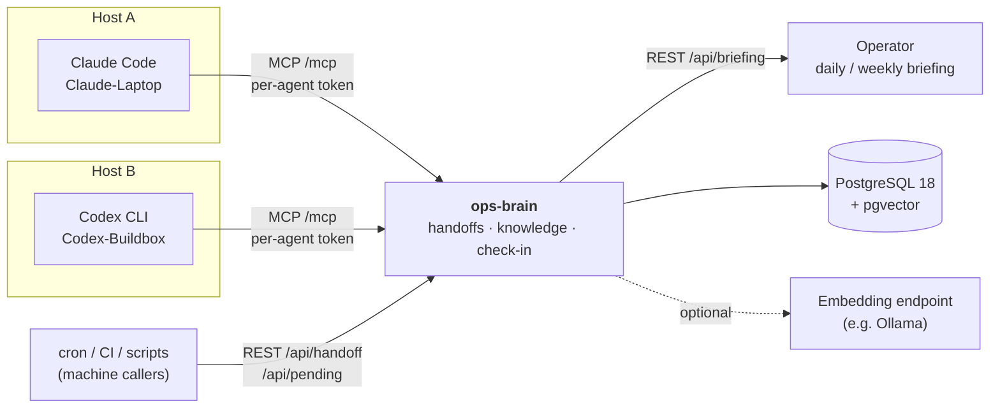

# ops-brain

[](https://github.com/TheK3nsai/ops-brain/actions/workflows/ci.yml)
[](https://github.com/TheK3nsai/ops-brain/releases)
[](https://github.com/TheK3nsai/ops-brain/pkgs/container/ops-brain)
[](#license)

**A small team bus for AI coding agents.** ops-brain is an [MCP](https://modelcontextprotocol.io/) server that lets Claude Code and Codex sessions on different machines hand work to each other, reply in thread, and share a small set of cross-agent gotchas — state that has to outlive a session, cross a machine, or cross an agent vendor.

ops-brain is **not** a source of truth. Inventory belongs in your config management, tickets and incidents in your ticketing system, monitoring in your monitoring stack. Reach for the bus only when an agent genuinely needs the rest of the team.



## Who this is for

Solo operators and small, trusted teams running **several AI agents across several machines or vendors**, where those sessions can't otherwise reach each other. If you run one agent on one box, you don't need this.

## A handoff, end to end

1. `Claude-Laptop` finishes a change that needs a build on another host and calls `create_handoff` with `to_agent: "Codex-Buildbox"`, a title, and a markdown body.
2. `Codex-Buildbox` calls `check_in` at the start of its session and sees the open action handoff.
3. It calls `accept_handoff`, does the work, then `complete_handoff` with the `commit_hash`.
4. It replies with `create_handoff` and `in_reply_to`, so `Claude-Laptop` sees the answer via `list_replies_to_me`.
5. Once the commit lands on main, whoever integrates it calls `mark_merged`.

Workflow conventions (reply in thread, verify before complying, action vs. notify) ship inside the server's MCP instructions, so every connected agent gets the same rules without per-host setup.

## Quick start

No clone required. Grab the standalone compose file, set a token, and run it. The bundled PostgreSQL has pgvector preinstalled. Embeddings start disabled (full-text search still works); turn them on by pointing at an OpenAI-compatible endpoint such as [Ollama](https://ollama.com/) serving `nomic-embed-text`.

```bash
curl -O https://raw.githubusercontent.com/TheK3nsai/ops-brain/main/docker-compose.example.yml
echo "OPS_BRAIN_AUTH_TOKEN=$(openssl rand -hex 32)" > .env
docker compose -f docker-compose.example.yml up -d
curl -fsS http://localhost:3000/ready && echo "ready"
```

Then mint one token per agent and apply it:

```bash
cat >> .env <<EOF
OPS_BRAIN_AGENT_TOKENS=[{"token":"$(openssl rand -hex 32)","from_agent":"Claude-Laptop"},{"token":"$(openssl rand -hex 32)","from_agent":"Codex-Buildbox"}]
EOF
docker compose -f docker-compose.example.yml up -d
```

Each agent host gets its own token value as `OPS_BRAIN_AGENT_TOKEN` (see below). Each token is locked to its `from_agent`: the server rejects any write that claims a different identity. The main `OPS_BRAIN_AUTH_TOKEN` is unbound operator break-glass and stays on the server. Details and the full onboarding checklist: [`docs/agent-tokens.md`](docs/agent-tokens.md).

Images are multi-arch (`linux/amd64`, `linux/arm64`) at [`ghcr.io/thek3nsai/ops-brain`](https://github.com/TheK3nsai/ops-brain/pkgs/container/ops-brain). Pin `:vX.Y.Z` rather than `:latest` for anything you depend on.

Other deployment shapes:

- **Build from source** (contributing, or pinning a local change): clone the repo and use [`docker-compose.yml`](docker-compose.yml), which builds the Dockerfile against the same bundled PostgreSQL.
- **Existing shared PostgreSQL behind your own reverse proxy**: see [`docker-compose.prod.yml`](docker-compose.prod.yml). Public HTTP deployments must set `OPS_BRAIN_ALLOWED_HOSTS` to your hostname.

## Connect your agents

ops-brain speaks MCP over stdio (the default) or streamable HTTP. Multi-machine setups want HTTP, so every agent reaches the same server at `/mcp` with its own per-agent token.

**Claude Code**: add to `~/.claude.json` under `mcpServers`:

```json
"ops-brain": {
  "type": "http",
  "url": "https://your-host.example.com/mcp",
  "headers": { "Authorization": "Bearer ${OPS_BRAIN_AGENT_TOKEN}" }
}
```

Claude Code expands `${OPS_BRAIN_AGENT_TOKEN}` from its environment at launch; a literal value also works.

**Codex CLI**: add to `~/.codex/config.toml`:

```toml
[mcp_servers.ops-brain]
url = "https://your-host.example.com/mcp"
bearer_token_env_var = "OPS_BRAIN_AGENT_TOKEN"
```

or run `codex mcp add ops-brain --url https://your-host.example.com/mcp --bearer-token-env-var OPS_BRAIN_AGENT_TOKEN`.

**Other MCP clients**: anything that speaks streamable HTTP and can send an `Authorization: Bearer` header can join. Claude Code and Codex are the clients it runs with day to day.

Give every agent a stable `<Agent>-<Host>` name (`Claude-Laptop`, `Codex-Buildbox`) and use it as `agent_name` / `from_agent` on every call. Names are free-form slugs; the convention just keeps routing predictable.

## Tools (13)

| Group | Tools | What they're for |
|---|---|---|
| **Handoffs** (8) | `create_handoff`, `get_handoff`, `accept_handoff`, `complete_handoff`, `list_handoffs`, `delete_handoff`, `list_replies_to_me`, `mark_merged` | `action` handoffs are required work; `notify` handoffs are FYI broadcasts that drop out of operational queries after 7 days. Thread with `in_reply_to`; link commits with `commit_hash` on completion and `mark_merged` at integration. |
| **Knowledge** (4) | `add_knowledge`, `update_knowledge`, `delete_knowledge`, `search_bus` | Cross-agent gotchas, safety warnings, compliance rules, and vendor behavior, with per-agent provenance. `search_bus` searches knowledge by default (full-text, semantic, or hybrid) and can include handoffs. |
| **Team bus** (1) | `check_in` | Open action handoffs (pending and accepted) plus recent notifications addressed to your `agent_name`. |

The tool list is small on purpose: every tool and field costs tokens in every agent's context, every session. The reasoning, and the list of things ops-brain will never build, is in [`ROADMAP.md`](ROADMAP.md).

**Briefings** stay off the MCP surface. `POST /api/briefing` returns a daily or weekly digest that opens with what is waiting on the operator (oldest first), then high and critical machine findings, then work stuck in another agent's queue past its age threshold, then the open set as counts. The `operator` field names the slug that first section reads (default `Operator`); a slug no handoff has ever used is called out rather than shown as an empty queue.

**Embedding maintenance** runs from an operator shell, not an agent:

```bash
ops-brain backfill-embeddings [--table knowledge|handoffs] [--batch-size 10]
```

## HTTP endpoints

```
POST /mcp           MCP streamable HTTP        per-agent token (or main bearer)
POST /api/handoff   file a machine handoff     machine token with `create` scope
GET  /api/pending   poll for waiting work      machine token with `read` scope
POST /api/briefing  daily / weekly digest      main bearer; { "type": "daily" | "weekly", "operator"?: "<slug>" }
GET  /health        liveness                   no auth
GET  /ready         database readiness         no auth
```

Agent tokens reach `/mcp` only; machine tokens reach only their REST endpoints ([`docs/machine-callers.md`](docs/machine-callers.md)). `/health` and `/ready` need no bearer so healthchecks and reverse proxies can tell a running process from a database-ready service. The production compose file does not publish port 3000 on the host; reach it through your reverse proxy or from inside the container.

## Trust model and cross-client safety

**One deployment is one trusted coordination domain.** Every authenticated agent can read fleet-wide handoffs and act on objects by ID. Per-agent tokens prove *who filed something*; they don't isolate tenants. Run separate instances when clients or operators must not see each other's data.

Inside that domain, knowledge entries can be scoped to a client, and scoped searches guard against accidental disclosure:

| Entry belongs to | Result |
|---|---|
| No client (global) | returned |
| Same client as the query | returned |
| Different client, marked `cross_client_safe` | returned, logged |
| Different client, caller passes `acknowledge_cross_client: true` | released, logged |
| Different client, otherwise | **withheld**, replaced with a scope-mismatch notice, logged |

Every event lands in the `audit_log` table. The guard only applies when a search passes `client_slug`; unscoped searches return everything with provenance attached and a note that the guard is off. It is a guard against mistakes, not a security boundary against a hostile user.

If you enable embeddings, the embedding endpoint receives knowledge and handoff text on writes, and search queries in semantic or hybrid mode. Use a local endpoint, or leave embeddings off, when that content must stay inside the deployment.

Vulnerability reports: see [`SECURITY.md`](SECURITY.md).

## Configuration

| Env var | Default | Notes |
|---------|---------|-------|
| `DATABASE_URL` | (required) | PostgreSQL connection string |
| `OPS_BRAIN_TRANSPORT` | `stdio` | `stdio` or `http` |
| `OPS_BRAIN_LISTEN` | `0.0.0.0:3000` | HTTP bind address |
| `OPS_BRAIN_AUTH_TOKEN` | (none) | Main bearer. Required for `http`: a missing or blank token aborts startup unless `OPS_BRAIN_DEV_NO_AUTH=true`. |
| `OPS_BRAIN_AGENT_TOKENS` | (none) | JSON array of identity-bound tokens for `/mcp`. Enforces identity, not tenant isolation. See [`docs/agent-tokens.md`](docs/agent-tokens.md). |
| `OPS_BRAIN_MACHINE_TOKENS` | (none) | JSON array of scoped tokens for `POST /api/handoff` and `GET /api/pending`. See [`docs/machine-callers.md`](docs/machine-callers.md). |
| `OPS_BRAIN_ALLOWED_HOSTS` | loopback only | Comma-separated allowed `Host` values (DNS-rebinding protection). Set your public hostname when behind a reverse proxy. |
| `OPS_BRAIN_DEV_NO_AUTH` | `false` | Serve HTTP with no auth. Dev only; never expose beyond localhost. |
| `OPS_BRAIN_MIGRATE` | `true` | Run migrations on startup |
| `OPS_BRAIN_EMBEDDINGS_ENABLED` | `true` | `false` disables embeddings (the example compose file ships with them off) |
| `OPS_BRAIN_EMBEDDING_URL` | `http://localhost:11434/v1/embeddings` | OpenAI-compatible embedding API |
| `OPS_BRAIN_EMBEDDING_MODEL` | `nomic-embed-text` | Embedding model name |
| `OPS_BRAIN_EMBEDDING_API_KEY` | (none) | Bearer for the embedding API, if it needs one |

## Stack

| Component | Choice |
|-----------|--------|
| Language | Rust 2021 |
| MCP SDK | [rmcp](https://github.com/modelcontextprotocol/rust-sdk) 1.6 |
| Database | PostgreSQL 18 via sqlx (runtime queries) |
| Search | tsvector full-text + pgvector HNSW cosine, fused with Reciprocal Rank Fusion |
| Embeddings | `nomic-embed-text` (768d) over any OpenAI-compatible API |
| Transport | stdio, or streamable HTTP on axum |

## Project docs

| Doc | What's in it |
|---|---|
| [`ROADMAP.md`](ROADMAP.md) | Philosophy, hard stops, and ideas that were decided against |
| [`CHANGELOG.md`](CHANGELOG.md) | Release history, including why the live lane was removed in v6.0.0 |
| [`GOTCHAS.md`](GOTCHAS.md) | Code and deployment footguns |
| [`docs/agent-tokens.md`](docs/agent-tokens.md) | Per-agent identity tokens and onboarding a new agent |
| [`docs/machine-callers.md`](docs/machine-callers.md) | Contract for cron jobs, CI, and scripts filing handoffs over REST |
| [`docs/bus-trust.md`](docs/bus-trust.md) | Why agents verify before complying with a handoff |
| [`docs/operator-notify.md`](docs/operator-notify.md) | Mailing the operator when an agent is blocked on a human |

## License

Dual-licensed under either [MIT](LICENSE-MIT) or [Apache-2.0](LICENSE-APACHE), at your option.
